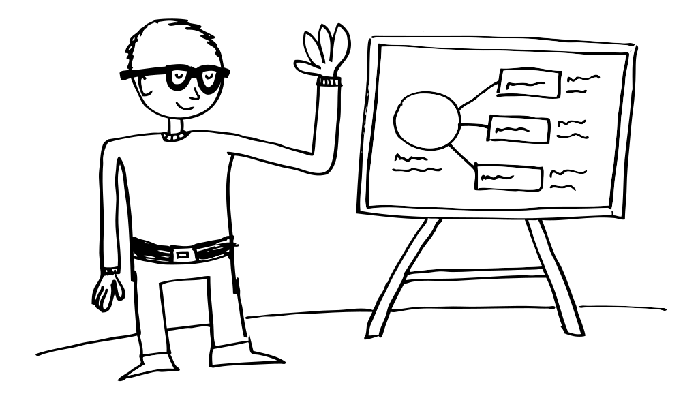

# Ben Franck

I am a UX Designer at [nForm](https://www.nform.com). I use doodling, interactive prototyping, and usability testing to help teams explore ideas and create solid designs for complex web applications. During my time off I enjoy touring on my folding bike, playing narrative-driven video games, and cooking the perfect apple oatmeal pancakes. I'd love to talk with you!

- Mention me on [Twitter](https://www.twitter.com/bdfranck)
- View my code on [Github](https://github.com/bdfranck)
